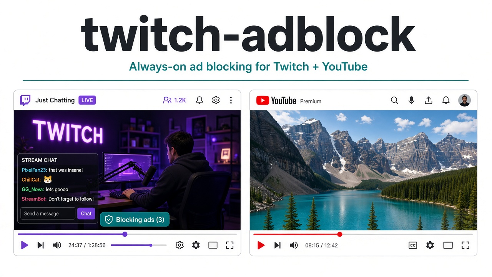
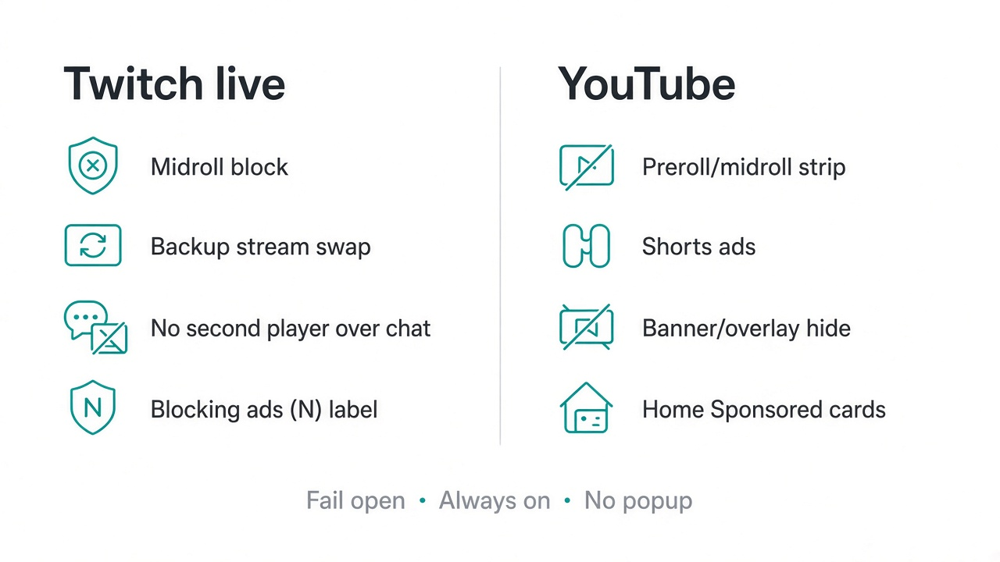
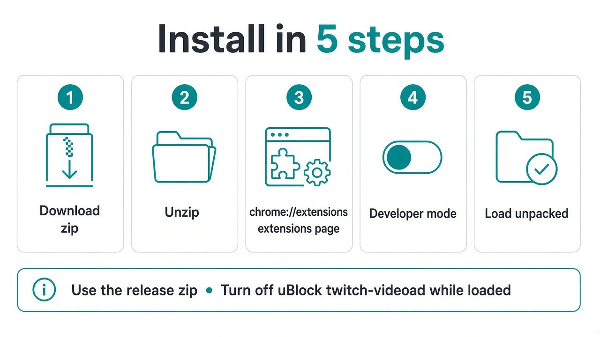
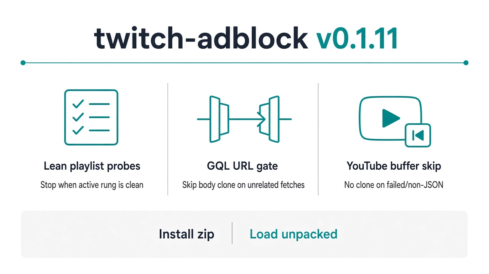

# twitch-adblock

  

**Stable:** [twitch-adblock-0.1.18.zip](https://github.com/gecko-of-shadow/twitch-adblock/releases/download/v0.1.18/twitch-adblock-0.1.18.zip) · **Beta:** [twitch-adblock-0.1.20.zip](https://github.com/gecko-of-shadow/twitch-adblock/releases/download/v0.1.20/twitch-adblock-0.1.20.zip) · Twitch live + YouTube

---

## What it does

  

---

## Install

  

1. Download a [release zip](https://github.com/gecko-of-shadow/twitch-adblock/releases) (not a random git checkout). Use **0.1.18** for stable playback. Use the **0.1.20 beta** to try the new midroll handling (it keeps the temporary debug popup).
2. Unzip → `chrome://extensions` → Developer mode → **Load unpacked** → pick the folder with `manifest.json`.
3. While this is loaded, turn off uBlock’s `twitch.tv##+js(twitch-videoad)` / video-swap-new **and any other Twitch ad extension** (purple lightning icons included). **One ad script per page.** Two scripts on the same Twitch tab can freeze video while chat still moves.

---

## What’s new in 0.1.20 (beta)

**Beta prerelease.** **v0.1.18 stays the stable playback release.**

- **Midrolls after a normal page load are caught.** A midroll that starts while you watch swaps to the backup stream without a manual page reload.
- **Backup first.** If the first backup turns dirty, the next clean backup is tried. Real ads pass through only when every backup is dirty or unreachable, so the video keeps playing.
- **At most two player reloads per break** (one to enter the backup, one to leave). A backup that gets its own ad plays it rather than hopping again.
- **Newer Twitch “maf” ad breaks.** The single ad marker is removed from live playlists. Video, sound, and segment numbers are untouched, with no backup swap and no reload.
- **No A/V loops.** Ad slots are dropped without repeating a live segment, and segment numbers stay steady between refreshes.
- **Player banners.** Stream display ad wrappers that cover or squeeze the live picture are hidden. Anything that holds the video is never hidden.
- **Temporary debug popup** (ON / OFF / Copy debug) stays. Copy now reads the player's frame.
- **Debug on by default (temporary).** A fresh install records the in-memory debug log with no action needed. Tokens are still redacted, the log stays on your device, and OFF in the popup turns it off for that tab.

  

---

## Notes

- Twitch: live midrolls only (VODs/clips pass through). Backup swap may change quality briefly; playback should keep going.
- YouTube: player ads + home Sponsored cards. Ads already muxed into the file still play (fail open).
- Dev: `deno test --no-lock test/` · `bash scripts/release-gate.sh` · `bash scripts/pack-zip.sh`
