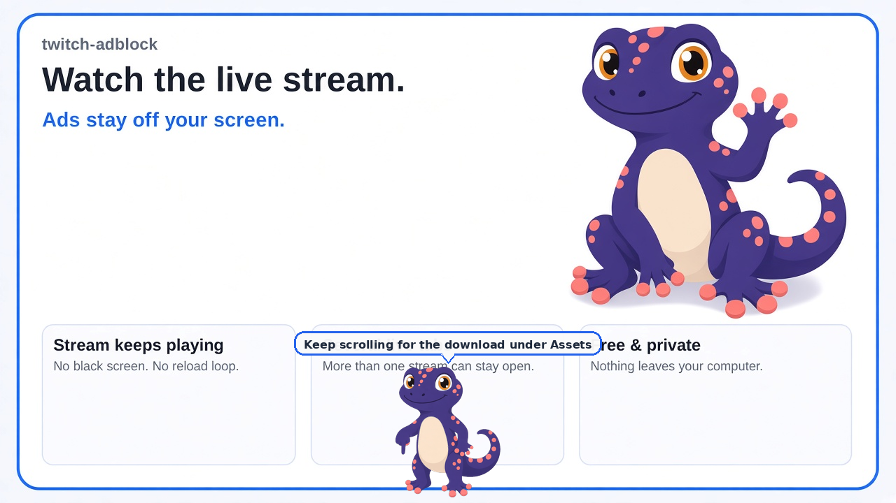
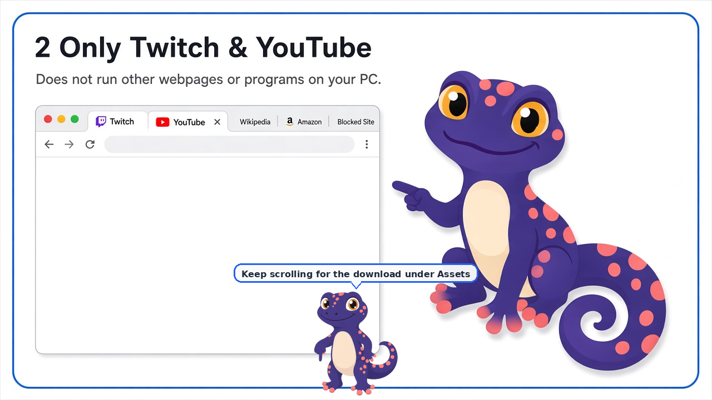
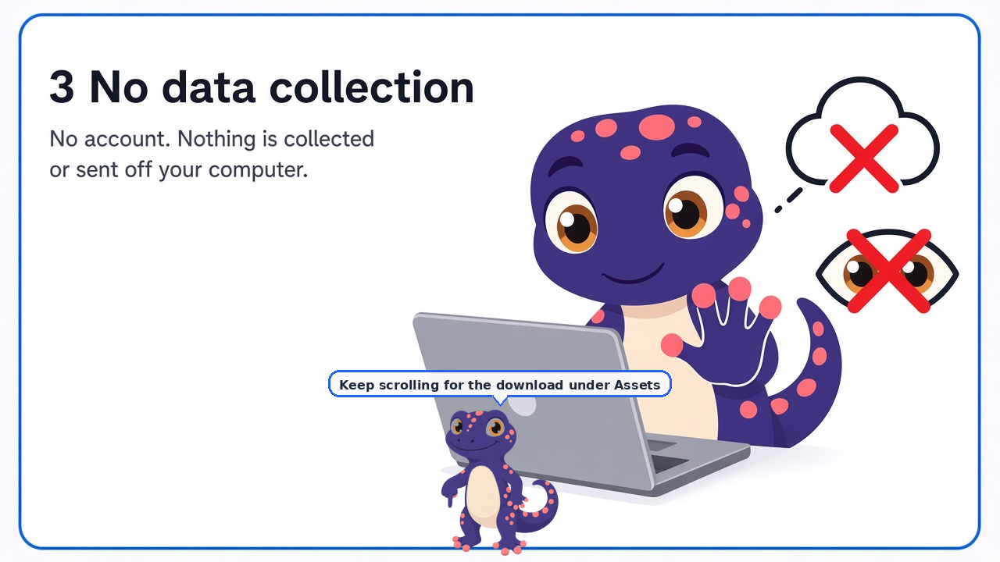
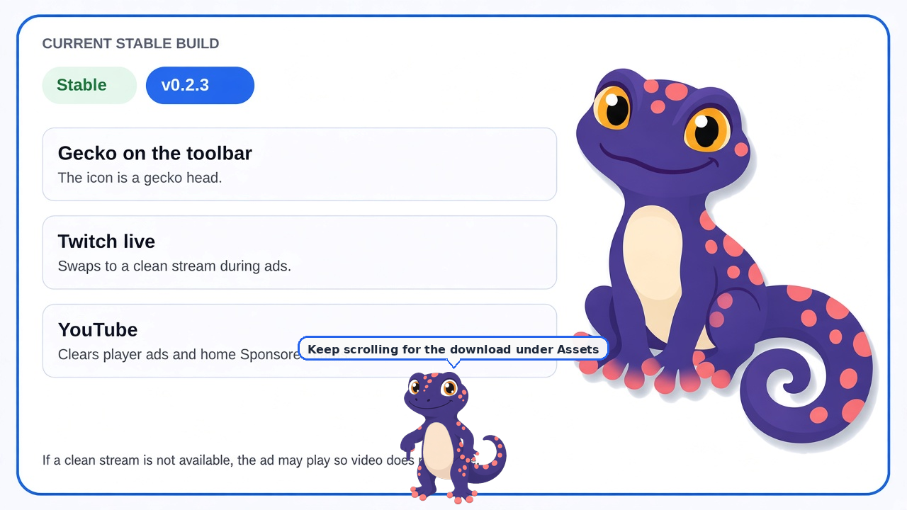
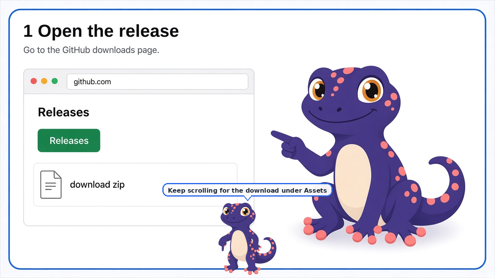
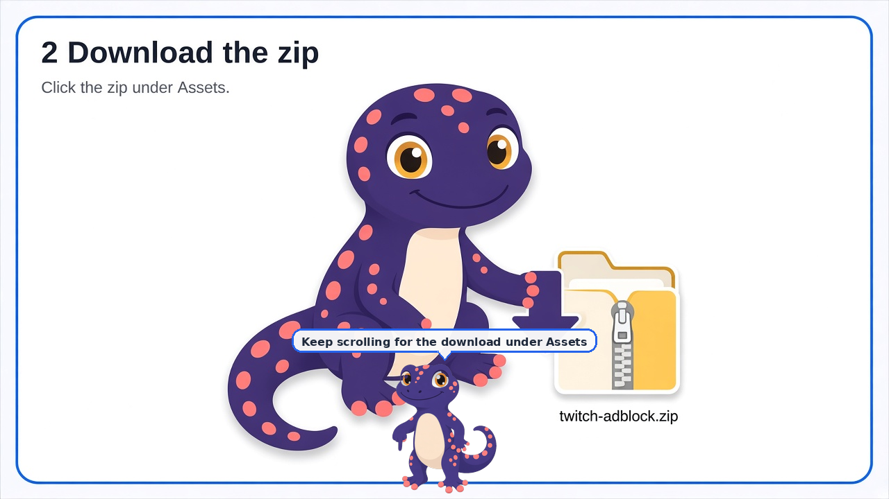
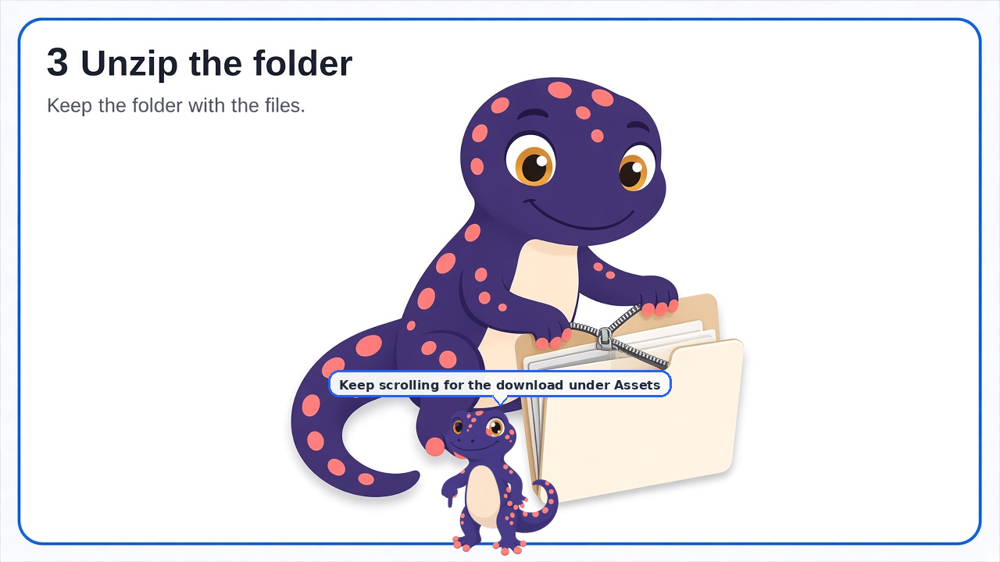
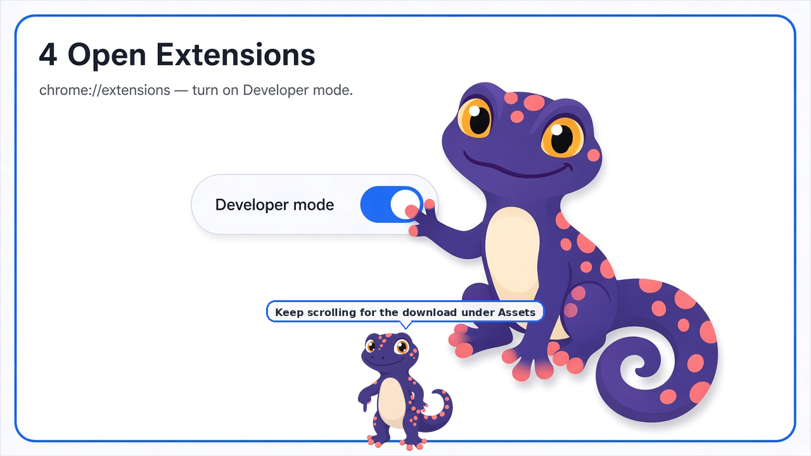
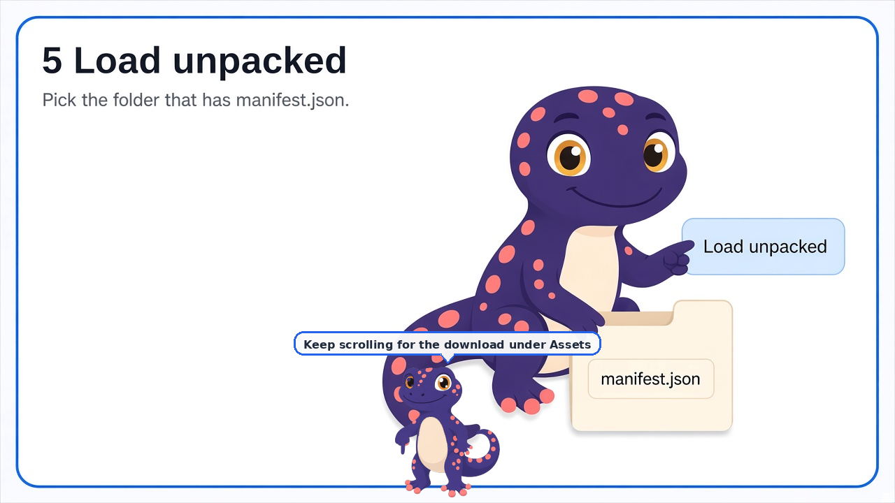
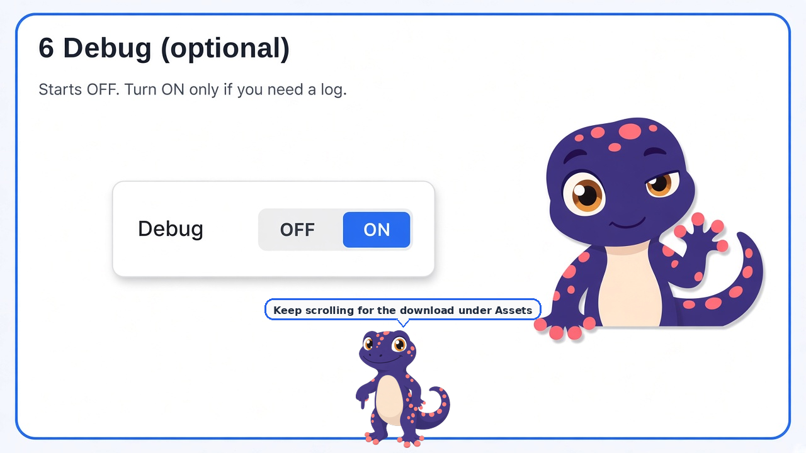

# twitch-adblock

**Watch the live stream. Ads stay off your screen.**

- The stream keeps playing. No black screen, no reload loop.
- Works with several live tabs open.
- Free. No account. Nothing leaves your computer.

A free Chrome extension for Twitch live streams and YouTube. It runs only in your browser and does not send data anywhere.

## What it does

- **Twitch live:** during a commercial break, it switches to a clean copy of the same stream, then switches back when the break ends. If a clean copy is not available, the ad may play so your video does not freeze.
- **YouTube:** removes player ads and Sponsored cards on the Home page.
- VODs and clips are left alone.

## Is this safe?

It only runs inside Chrome on Twitch and YouTube.

- **Only Twitch and YouTube** — does not open or run other webpages, and does not install programs on your PC.
- **No data collection** — no account, nothing collected, nothing sent off your computer.

## Current build

The toolbar icon is a gecko head. Twitch and YouTube work as described above.

Debug starts **off**. You only need it if something goes wrong (see step 6 below).

Full notes: [v0.2.3 release](https://github.com/gecko-of-shadow/twitch-adblock/releases/tag/v0.2.3).

## Install (for first-time Chrome installs)

You do **not** need a GitHub account. You are only downloading a zip and loading it in Chrome like a local app.

### 1. Open the release page

Or skip ahead and use the download button in step 2.

### 2. Download the zip

↓ The download is right under this picture:

**[Download twitch-adblock-0.2.3.zip](https://github.com/gecko-of-shadow/twitch-adblock/releases/download/v0.2.3/twitch-adblock-0.2.3.zip)**

On the release page, the file is also listed under **Assets**.

### 3. Unzip the folder

- Windows: right-click the zip → **Extract All…**
- Mac: double-click the zip

Keep the folder that appears. Do not delete it after install — Chrome reads the extension from that folder.

### 4. Open Chrome Extensions

1. Open a new tab and go to `chrome://extensions`
2. Turn on **Developer mode** (top right)

### 5. Load unpacked

1. Click **Load unpacked**
2. Choose the unzipped folder (the one that contains `manifest.json`)
3. You should see twitch-adblock in the list, with the gecko icon

Turn off other Twitch or YouTube ad blockers while this is loaded. Two ad blockers on the same page can freeze the video.

### 6. Debug (optional)

Debug starts **OFF**. Leave it off for normal watching.

If something looks wrong:

1. Click the gecko icon in Chrome to open the popup
2. Turn **Debug** ON
3. Click **Copy debug**
4. Paste that text into a [GitHub issue](https://github.com/gecko-of-shadow/twitch-adblock/issues)

The log stays on your computer until you copy it. Nothing is sent automatically. Turn Debug **OFF** again when you are done.

## Notes

- Picture quality can dip briefly during a Twitch ad break. Playback should keep going.
- Ads already baked into a YouTube video file still play.
- Development: `deno test --no-lock test/` · `bash scripts/release-gate.sh` · `bash scripts/pack-zip.sh`
