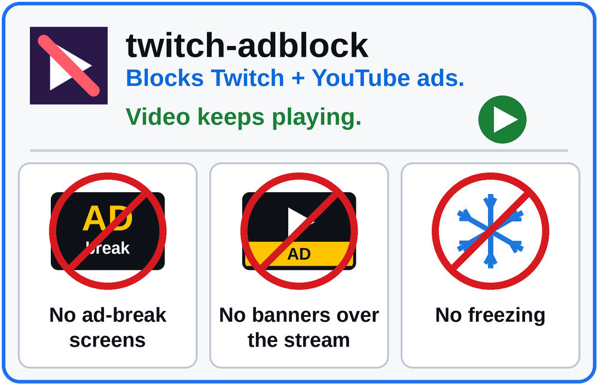
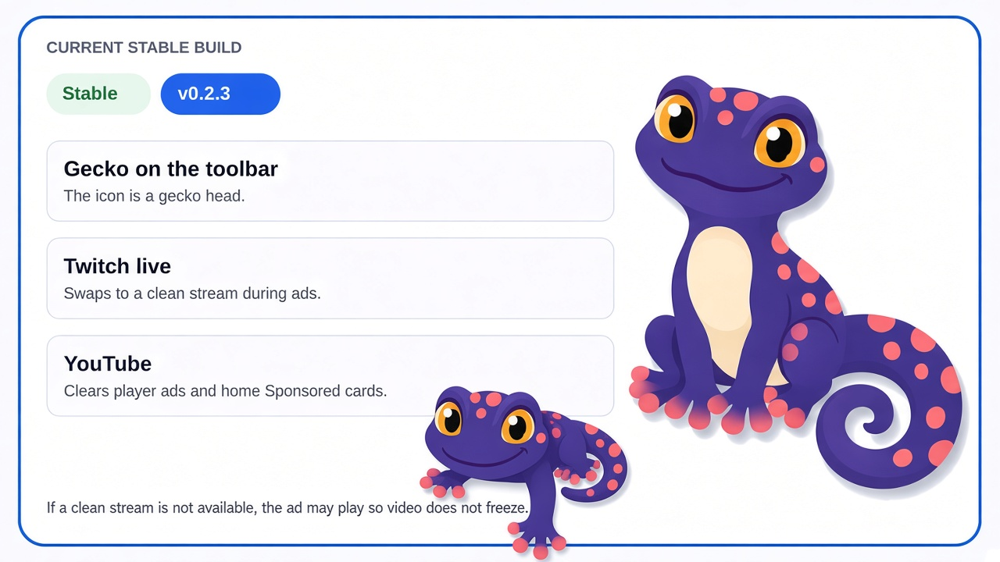
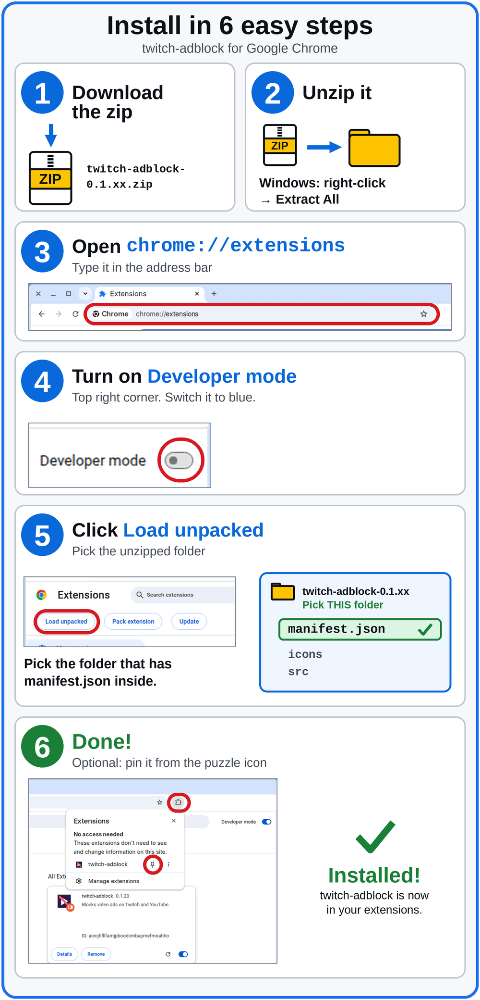
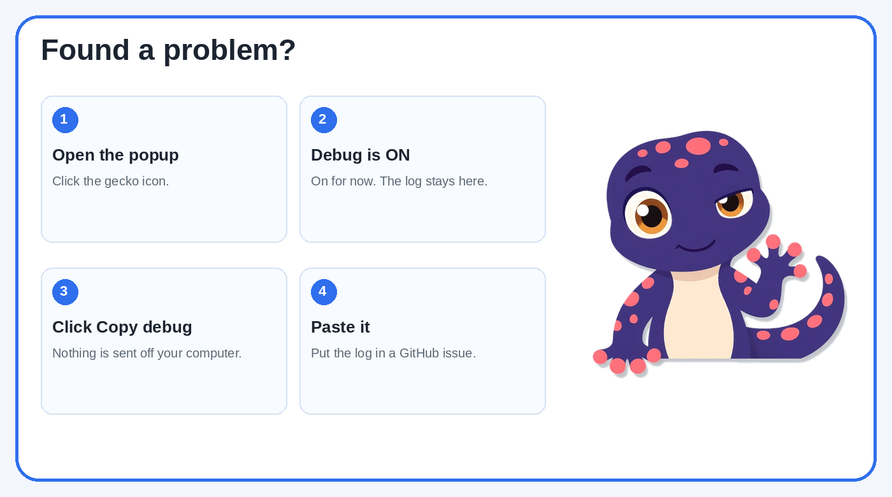

# twitch-adblock

A Chrome extension that blocks ads on Twitch live streams and YouTube. It is free, runs only in your browser, and sends nothing anywhere.

## What it does

- **Twitch live:** when a midroll starts, it switches to an ad-free backup of the same stream and switches back when the break ends. If no clean backup is available, it lets the ad play instead of freezing your video.
- **YouTube:** removes player ads and the Sponsored cards on the home page.
- **Kick:** skips an in-player ad when the player can jump back to the stream. If it cannot, the ad plays. The stream stays unmuted.
- Twitch VODs and clips pass through untouched.

## Current version: v0.1.21 (beta)

This is a beta, and it is the only release right now. Midrolls are caught without a page reload, the player reloads at most twice per minute, it backs off after a false alarm (an ad may play instead of freezing), and newer Twitch ad markers are cleaned out of the stream. Kick is not in this zip yet.

A small debug popup is **on by default for now (temporary)**. It keeps a short log in memory on your device, hides login tokens, and sends nothing out. Open the extension popup to turn it off or to copy the log if you need to report a problem.

Details are in the [v0.1.21 release notes](https://github.com/gecko-of-shadow/twitch-adblock/releases/tag/v0.1.21).

## Install

**[Download twitch-adblock-0.1.21.zip](https://github.com/gecko-of-shadow/twitch-adblock/releases/download/v0.1.21/twitch-adblock-0.1.21.zip)**

1. Download the zip above and unzip it.
2. Open `chrome://extensions` and turn on **Developer mode**.
3. Click **Load unpacked** and pick the folder that holds `manifest.json`.
4. Turn off other Twitch or YouTube ad blockers and scripts while this is loaded. Two ad scripts on one page can freeze the video.

## Found a problem?

## Notes

- Backup swaps can change the picture quality briefly. Playback should keep going.
- Ads already baked into a YouTube video file still play.
- All releases are listed on the [releases page](https://github.com/gecko-of-shadow/twitch-adblock/releases).
- Development: `deno test --no-lock test/` · `bash scripts/release-gate.sh` · `bash scripts/pack-zip.sh`
